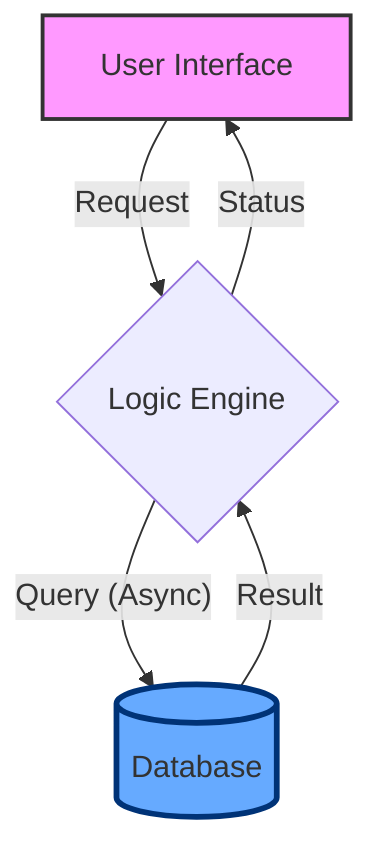
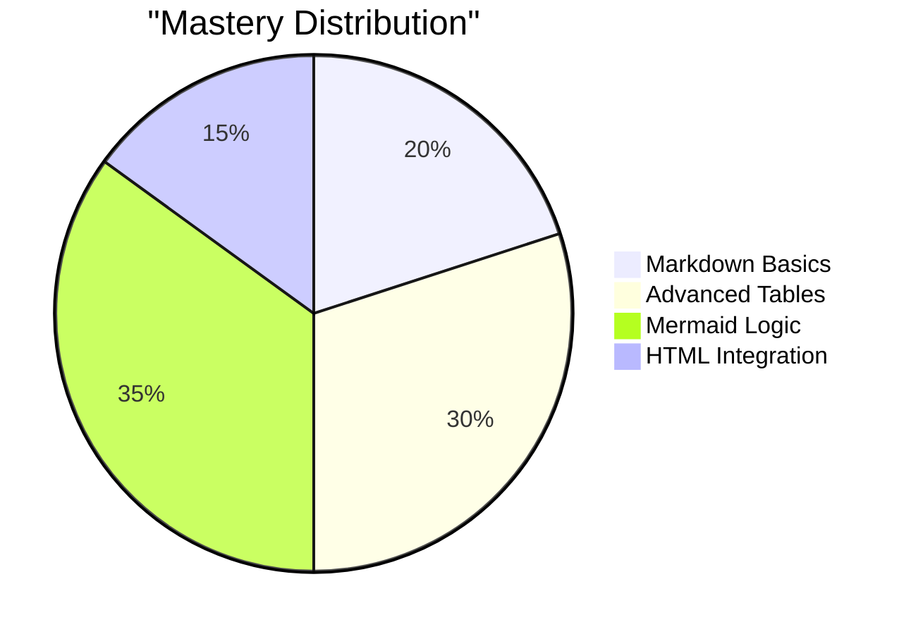

# 🚀 A113221035: The Ultimate Markdown Mastery

A high-performance, precision-crafted registry for mastering the art of __`Markdown`__.

[](https://github.com/adam-p/markdown-here/wiki/Markdown-Cheatsheet)


---

## 📑 Table of Contents

- [📖 The Philosophy](#-the-philosophy)
- [🛠 The Arsenal](#-the-arsenal)
  - [1. Textual Foundations](#1-textual-foundations)
  - [2. Global Connectivity](#2-global-connectivity)
  - [3. Code Architecture](#3-code-architecture)
  - [4. Structural Intelligence](#4-structural-intelligence)
- [📈 Visual Logic](#-visual-logic)
- [⚛️ The God Mode](#️-the-god-mode)
- [✅ Mastery Checklist](#-mastery-checklist)
- [📂 Project Nexus](#-project-nexus)

---

## 📖 The Philosophy

Markdown is more than just text; it's a bridge between human readability and machine structure. This registry is designed for those who wish to transcend basics.

> [!NOTE]
> __Core Concept__
> Markdown was inspired by pre-existing conventions for marking up plain text in email and Usenet posts[^1].

> [!TIP]
> Use `[link text](url "Title")` to add a descriptive title that appears on hover.

---

## 🛠 The Arsenal

### 1. Textual Foundations

- __Primary__: `**Bold**` for __Maximum Impact__.
- __Secondary__: `*Italic*` for *Subtle Nuance*.
- __Correction__: `~~Strikethrough~~` to ~~remove obsolescence~~.
- __Emphasis__: `==Highlight==` (for compatible viewers) to ==illuminate== key facts.

---

### 2. Global Connectivity

Expand your reach with structured links and labels.

| Type | Syntax | Result |
| :--- | :--- | :--- |
| __Simple__ | `[Name](URL)` | [GitHub](https://github.com) |
| __Reference__ | `[Ref][1]` | [Google][1] |
| __Email__ | `<user@example.com>` | <m306.user@0x00.com> |

[1]: https://www.google.com

---

### 3. Code Architecture

Present code with the clarity of a senior developer.

<details>
<summary><b>🐍 View High-Efficiency Core Loop</b></summary>

```python
import sys
import time
from typing import List

def initialize_nexus(modules: List[str]) -> bool:
    """Simulates a secure system initialization process."""
    print(">>> Initializing Project Nexus A113221035...")
    for mod in modules:
        time.sleep(0.12)
        print(f"  [LOAD] {mod:.<20} [SUCCESS]")
    
    print("\n[READY] Core System Online.")
    return True

if __name__ == "__main__":
    nexus_modules = ["Data_Matrix", "Neural_Gate", "Logic_Core"]
    initialize_nexus(nexus_modules)
```

</details>

---

### 4. Structural Intelligence

Tables are the backbone of data presentation in Markdown.

| Module ID | Tier | Status | Security Hash |
| :--- | :---: | :---: | :--- |
| `A113` | `Ω` | 🟢 Active | `0x00...A1B2` |
| `B221` | `α` | 🟡 Syncing | `0x11...C3D4` |
| `X035` | `δ` | 🔴 Locked | `0x99...F0F0` |

---

## 📈 Visual Logic

Transform abstract data into intuitive visual flows using __Mermaid__.

### 🔄 System Architecture



### 📊 Allocation Overview



---

## ⚛️ The God Mode

Ascend to the peak of technical documentation.

### 📐 Mathematical Precision (LaTeX)

$$
\mathbf{V}_{out} = \frac{R_2}{R_1 + R_2} \mathbf{V}_{in}
$$
$$
\lim_{x \to \infty} \left( 1 + \frac{1}{x} \right)^x = e
$$

### 🎨 Custom Component (HTML/MD Hybrid)

<div align="center">
  <h3>✨ Session Progress Saved ✨</h3>
  <kbd>Ctrl</kbd> + <kbd>Shift</kbd> + <kbd>M</kbd> (Preview)
</div>

---

## ✅ Mastery Checklist

Track your progress through the registry.

- [x] Master __Basic Syntax__
- [x] Implement __Advanced Tables__
- [x] Design __Visual Logic Flows__
- [x] Integrate __LaTeX Math__
- [ ] Achieve __Markdown God Mode__

---

## 📂 Project Nexus

- [Readme](README.md) - Notning...
- [A113221035](A113221035.md) - This Registry.

[^1]: Wikipedia. (n.d.). *Markdown*. Retrieved March 5, 2026, from [Wikipedia](https://en.wikipedia.org/wiki/Markdown)

---
<p align="right"><i>Revision: Alpha-Nine-Echo</i></p>